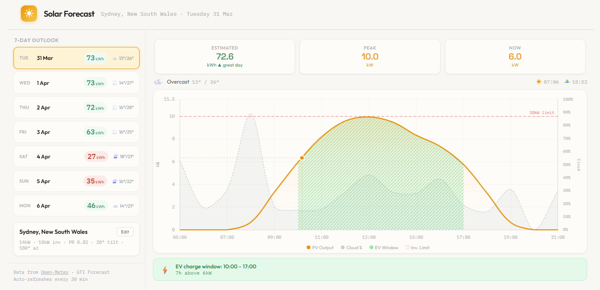
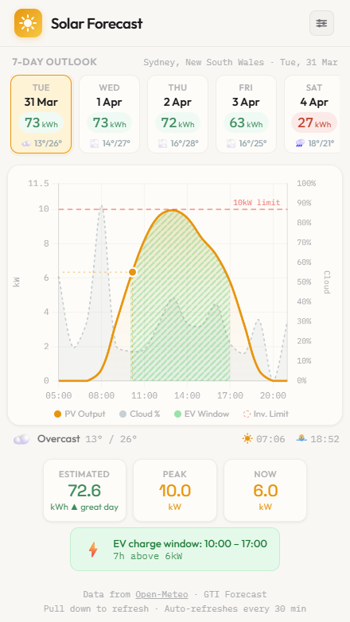

# Solar Forecast PWA

A responsive progressive web app that estimates photovoltaic output using [Open-Meteo's](https://open-meteo.com/) Global Tilted Irradiance (GTI) forecast API. No backend, no build step — a single HTML file you can host anywhere.


| Desktop | Mobile |
|---------|--------|
|  |  |

**Live:** [darylcl1984.github.io/pv-forecast](https://darylcl1984.github.io/pv-forecast/)

## Why This Exists

Most solar forecast tools are either locked behind inverter vendor apps, require paid subscriptions, or don't let you configure your actual system parameters. This app gives you a 7-day PV output forecast based on your real array size, inverter capacity, tilt, azimuth, and performance ratio — all running client-side with free API data.

## Features

- **Configurable system parameters** — array size, inverter limit, performance ratio, tilt, and azimuth; inline hints explain each field
- **7-day forecast** — colour-coded daily cards with kWh output, weather, and temperature; tap any day for an hourly PV chart with cloud cover overlay, inverter limit, and sunrise/sunset markers
- **Street-level place search** — Photon/OpenStreetMap autocomplete with Open-Meteo geocoding fallback
- **EV charge window detection** — finds the longest consecutive block above your charger's kW threshold and rates it great / fair / low yield
- **PWA installable** — Add to Home Screen on Android and iOS; service worker keeps the app available offline with a 6hr data cache
- **No backend** — single HTML file, no API key, no account required; deployable to any static host or GitHub Pages

## How It Works

The core calculation:

```
kW = min(inverterKw, (systemKw × performanceRatio × GTI_W/m²) / 1000)
```

GTI (Global Tilted Irradiance) is fetched from Open-Meteo's forecast API, which accounts for your panel tilt and azimuth. Output is clamped at inverter capacity. The app processes hourly GTI data into daily summaries, renders the chart, and identifies optimal EV charging windows.

All computation runs in the browser. No server, no API keys, no accounts.

## Quick Start

1. Clone this repo
2. Serve it over HTTPS (or `localhost`) — geolocation and the service worker need a secure context. GitHub Pages is fine. Opening `index.html` as a `file://` page will skip GPS and install.
3. Allow location access (or search for your address manually)
4. Confirm array size, inverter limit, tilt, azimuth, and performance ratio, then tap **Update Forecast**. Settings stay open until you do — allowing location alone does not finish setup.

### GitHub Pages Deployment

```bash
# The app is a single file — just enable GitHub Pages on main branch
# Settings → Pages → Source: Deploy from branch → main → / (root)
```

Your app will be live at `https://<username>.github.io/<repo-name>/`

## Configuration

| Parameter | Default | Description |
|-----------|---------|-------------|
| Array (kW) | 10 | Total panel capacity |
| Inverter (kW) | 8 | Inverter output limit |
| Performance Ratio | 0.80 | System efficiency factor (typically 0.75–0.85) |
| Tilt (°) | 22.5 | Panel tilt from horizontal |
| Azimuth (°) | Hemisphere | Panel direction — Open-Meteo convention: 0°=south, 180°=north. First-run default is 0° north of the equator and 180° south of it |
| Forecast Days | 7 | 1–16 days ahead |
| EV Threshold (kW) | 4 | Minimum output for EV charge window detection |

**Azimuth note:** Open-Meteo uses 0°=south convention (not 0°=north). For southern hemisphere north-facing panels, use ~180°. For east-facing use -90°, west-facing use 90°. First-run GPS/search sets this from the sign of latitude; change it if your roof does not face the equator.

## Calibration

The repo includes `tools/calibrate_pr.py`, a standalone Python script for calibrating your performance ratio against real inverter data. It reads Sungrow CSV exports from `tools/` (or the current directory) and fetches matching GTI from Open-Meteo's Historical Forecast API — the same product the PWA uses. **Set `LAT` and `LON` in the script before running.** **Don't commit your CSV exports** — they contain real production data; they're blocked by `.gitignore` by default.

```bash
# Place your Sungrow 5-minute CSV exports in tools/, edit LAT/LON/tilt/azimuth, then:
python tools/calibrate_pr.py
```

The script produces per-day and overall PR statistics, identifies clipped hours (using the hourly peak, not the mean), and recommends whether your current PR setting needs adjustment. Hourly inverter samples are joined to GTI on the preceding-hour window (stamp 14:00 = 13:00–14:00).

## Tech Stack

- Single HTML file (`index.html`) — HTML, CSS, JS, no build tools, no framework
- `sw.js` — service worker for PWA caching (network-first for navigations, cache-first for CDN assets)
- `manifest.json` + PNG icons — PWA install support for Android and iOS
- [Chart.js 4.4.1](https://www.chartjs.org/) via CDN
- [Open-Meteo API](https://open-meteo.com/) (free tier, CC BY 4.0) — GTI forecast
- [Photon](https://photon.komoot.io/) (OpenStreetMap) — place search / geocoding, with Open-Meteo geocoding as fallback
- Google Fonts: Outfit · IBM Plex Mono · Space Grotesk

## Limitations

- **Forecast accuracy:** GTI is a weather-model forecast, not measured irradiance. Partly cloudy days can show ±50% error vs actual production.
- **No measured production overlay:** The chart’s solid “To now” line is still the GTI model for hours that have already elapsed, not inverter output. Comparing against real production would require vendor API integration.
- **Free API tier:** 10K calls/day, non-commercial use. Fine for personal use; commercial deployment requires an Open-Meteo paid plan.

## License

MIT

## Attribution

Weather data provided by [Open-Meteo](https://open-meteo.com/) under CC BY 4.0. Place search via [Photon](https://photon.komoot.io/) / © [OpenStreetMap](https://www.openstreetmap.org/copyright) contributors.
